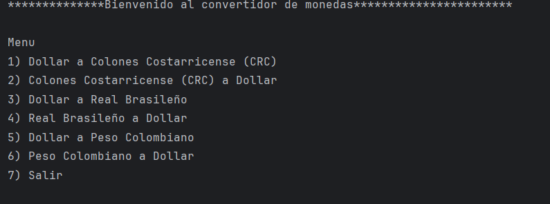
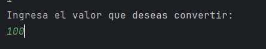

# Conversor de monedas G8

## Descripcion

##Aplicación en Java que permite convertir monedas de diferentes países utilizando tasas de cambio actualizadas.

## 🚀 Características
✅ Conversión entre múltiples monedas  
✅ API para obtener tasas de cambio en tiempo real  
✅ Interfaz gráfica intuitiva  
✅ Optimización para alto rendimiento  

## 🔧 Instalación
bash
git clone git@github.com:KarlaV30/conversor-monedas-G8.git
cd conversor-monedas-G8

## 💻 Uso
java -jar conversor-monedas-G8.jar

## Como luce

### tiene una bienvenida y un menu principal, en el cual debes elegir un numero que esta asociado con un comando de cambio de monedas.

## 🖥️ Vista previa de la interfaz

### Luego escoge la cantidad a convertir

### 🫡 Luego el resultado

